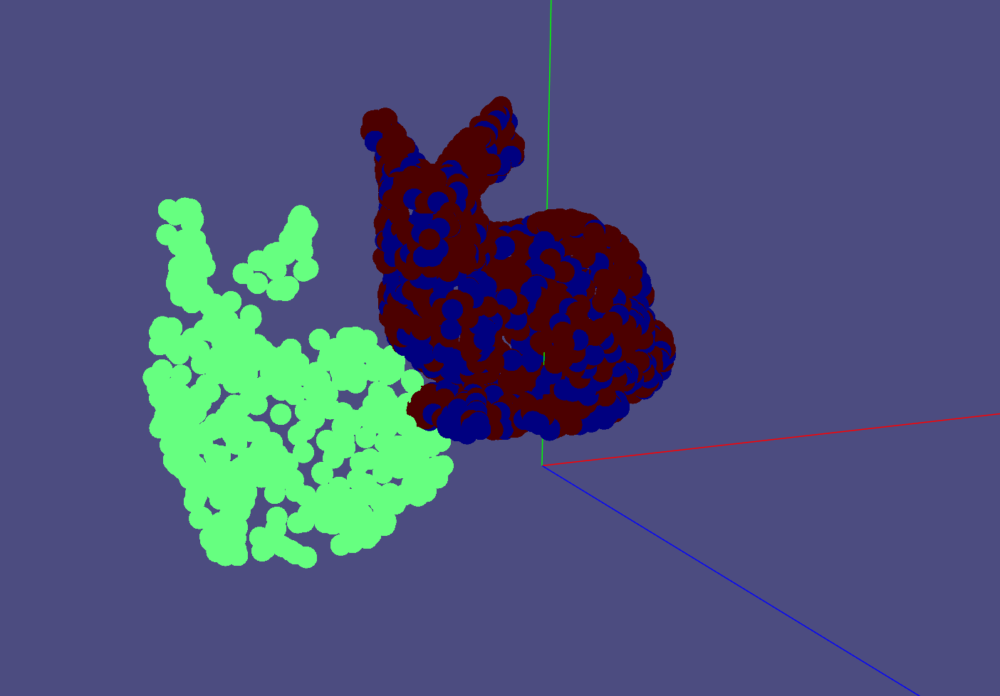
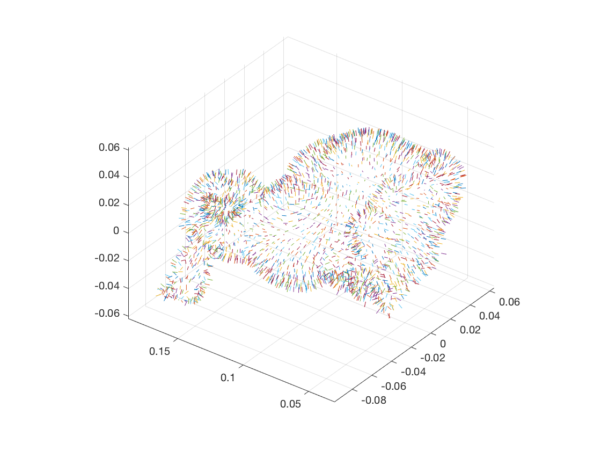
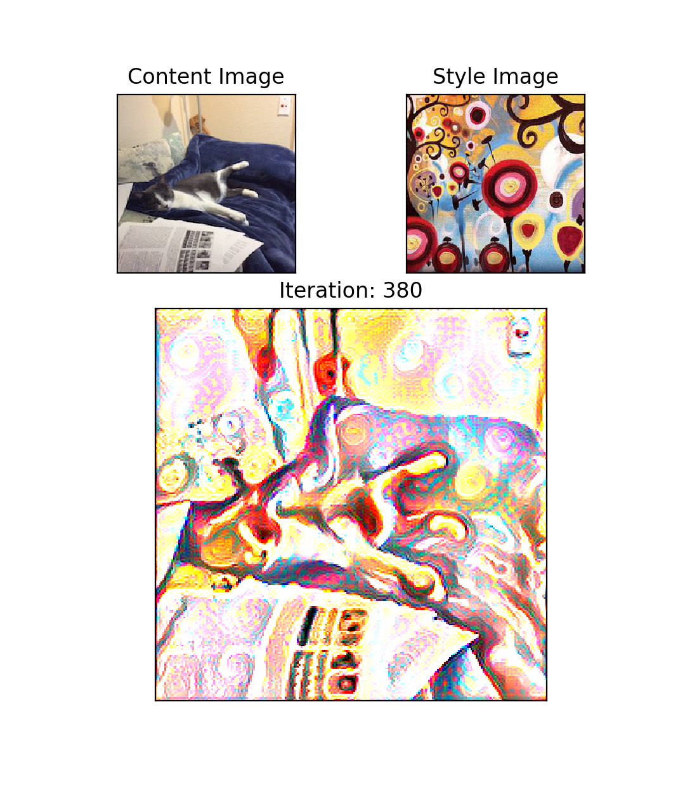
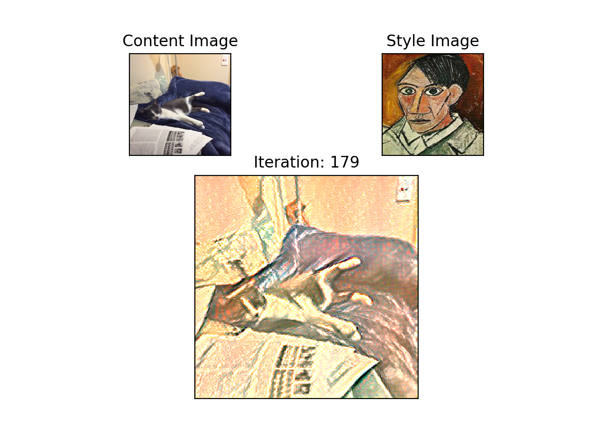
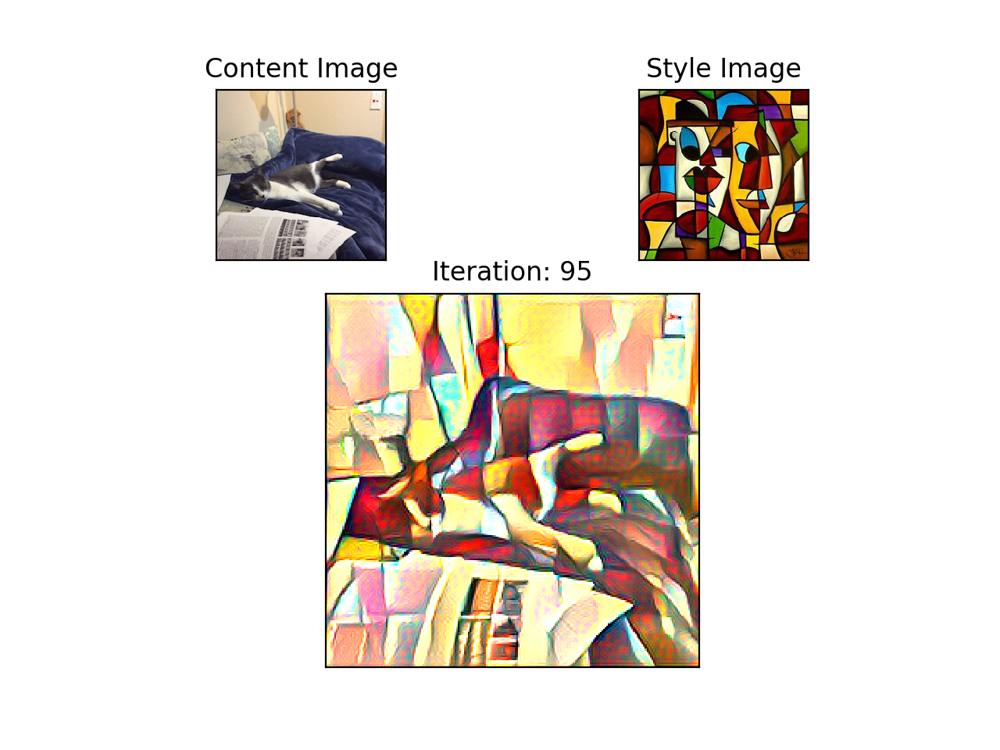
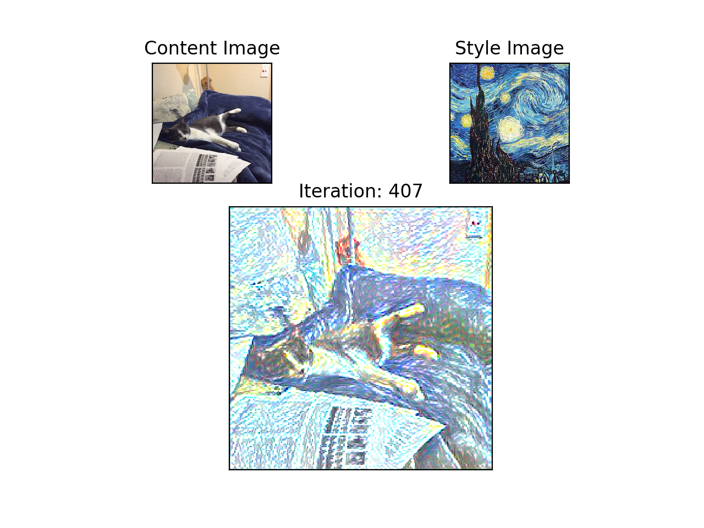
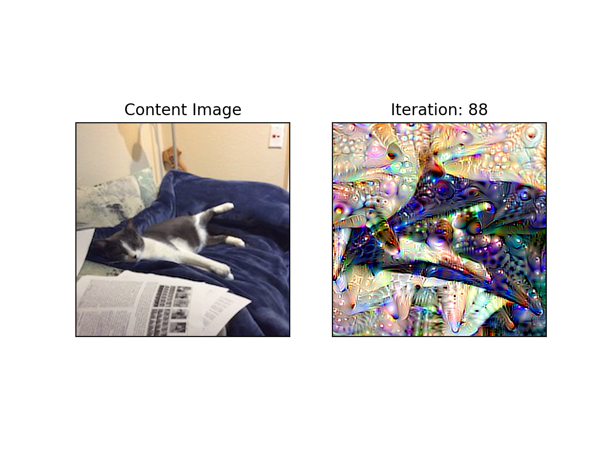
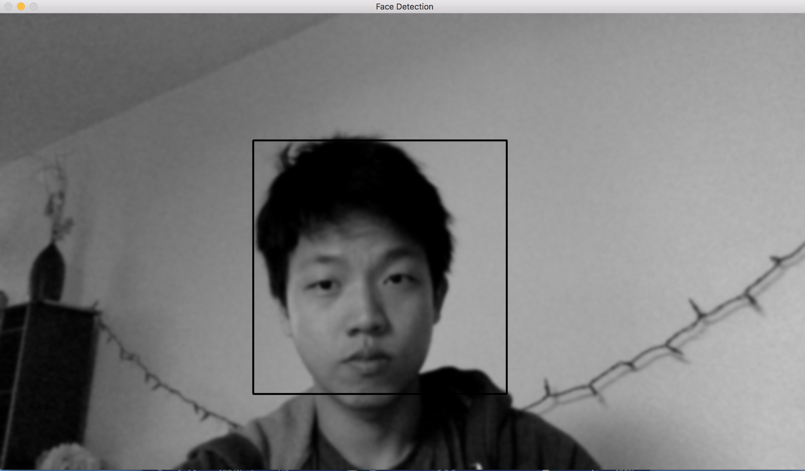

## Computer Vision

### Rigid ICP

This algorithm aligns two points clouds.

1. Point to point loss - SVD.
2. Point to plane loss - least squares.

### Normal Estimation

To compute an estimate of a normal at each point for a point cloud -

1. Take the nearest k neighbors.
2. Compute the covariance matrix.

The eigenvector with the smallest eigenvalue will be a good estimate for the normal.

### Style Transfer

This is an optimization problem trying to find the optimal image that minimizes a loss function consisting of content loss and style loss.

The content loss is a L2 distance between activation maps.

The style loss is a L2 distance between Gram Matrices (all combinations of dot products) of activation maps.

### Deep Dream

This is an optimization problem trying to find the optimal image that maximizes a random node in a deep network.

This is equivalent to doing gradient ascent on a loss function that consists just of the node's output.

### Face Detector

Given an image x, output a bounding box that encloses a face.

This is done through some naive kernels and using a linear SVM (through gradient descent) that was trained on a batch of 20 positive/negative samples.

